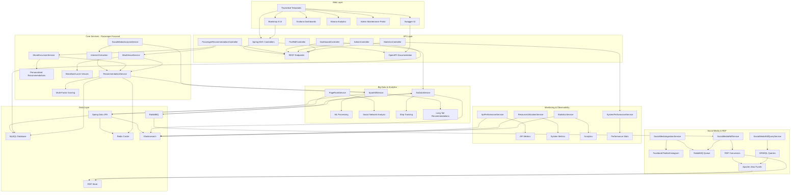

# Social Web Recommender for Cruising Ports

<div align="center">


**An intelligent Spring Boot recommendation system for cruise passengers, local businesses, and port authorities**

[Features](#-features) • [Architecture](#-architecture) • [Quick Start](#-quick-start) • [API Documentation](#-api-documentation) • [Contributing](#-contributing) • [License](#-license)

</div>

---

## 📋 Table of Contents

- [Overview](#-overview)
- [Features](#-features)
- [Architecture](#-architecture)
- [Technology Stack](#-technology-stack)
- [Quick Start](#-quick-start)
- [Installation](#-installation)
- [Configuration](#-configuration)
- [API Documentation](#-api-documentation)
- [Database Schema](#-database-schema)
- [Monitoring & Observability](#-monitoring--observability)
- [Development Roadmap](#-development-roadmap)
- [Contributing](#-contributing)
- [Support](#-support)
- [License](#-license)

## 🌟 Overview

The **Social Web Recommender for Cruising Ports** is a comprehensive Spring Boot application designed to revolutionize the cruise tourism experience. By leveraging RDF knowledge graphs, machine learning, real-time AIS ship tracking, and advanced analytics, it provides intelligent recommendations for cruise passengers while enabling local businesses and port authorities to prepare for incoming ships.

### Key Capabilities

- 🎯 **Passenger-Focused Recommendations**: AI-powered personalized suggestions based on voluntary interests and social media analysis
- 📱 **Social Media Analysis**: Extract interests from passenger digital presence (with consent)
- 🔗 **Social Media to RDF Integration**: Automatic conversion of social media posts (Facebook, Twitter, Instagram) to RDF triples for semantic querying
- 🏛️ **Must-See Highlights**: Personalized touristic attractions based on passenger interests
- 🚢 **Shore Excursion Recommendations**: Tailored excursion suggestions matching passenger preferences
- 🍽️ **Meal Venue Recommendations**: Locally active breakfast and lunch venues during port calls
- 📡 **Real-time AIS Ship Tracking**: Live cruise ship position monitoring with signal quality handling
- 🗺️ **Knowledge Graph Integration**: RDF/SPARQL-based semantic data processing via Apache Jena Fuseki
- 📊 **Big Data Analytics**: Apache Spark for ML, graph analysis, and long tail recommendations
- 🔍 **PageRank Analysis**: Social network analysis for influence detection
- 🏢 **Business Intelligence**: Analytics for local businesses and port authorities
- 📈 **System Performance Monitoring**: Comprehensive API performance, error tracking, and resource utilization monitoring
- 🔒 **Security & Privacy**: GDPR-compliant data handling, JWT authentication, secure Facebook integration, and user privacy protection

## ✨ Features

### For Cruise Passengers (Priority Focus)
- **Personalized Recommendations**: AI-powered suggestions based on voluntarily expressed interests
- **Social Media Integration**: Optional analysis of digital presence to enhance recommendations (with consent)
- **Facebook Login**: Secure social authentication with token validation and CSRF protection
- **Social Media Semantic Search**: Query social media posts by interests, keywords, hashtags, and ports via SPARQL
- **Must-See Highlights**: Personalized touristic attractions based on passenger interests
- **Shore Excursion Recommendations**: Tailored excursion suggestions for each port of call
- **Meal Venue Recommendations**: Locally active breakfast and lunch venues during port calls
- **Interest-Based Matching**: Recommendations weighted by your expressed preferences (40% weight)
- **Local Recommendations**: Prioritizes venues recommended by locals (30% weight)
- **Interactive Web Interface**: Beautiful Thymeleaf-based UI with Bootstrap 5
- **Real-time Ship Tracking**: View real-time position of your cruise ship via AIS
- **Port Exploration**: Interactive maps with port details, attractions, restaurants, and activities

### For Local Businesses
- **Publisher Dashboard**: Manage content, offers, and availability via REST APIs
- **Cruise Arrival Alerts**: Advance notifications about incoming ships and passenger estimates
- **Analytics & Insights**: Track customer preferences and booking patterns via Kibana dashboards
- **Dynamic Pricing**: Adjust rates based on demand and capacity
- **Customer Management**: Track reservations and customer preferences
- **Message Publishing**: Publish offers and updates to subscribers via RabbitMQ

### For Port Authorities
- **Infrastructure Planning**: Monitor capacity and resource requirements
- **Security Coordination**: Real-time passenger tracking and safety management
- **Economic Impact**: Analyze tourism revenue and business performance
- **Emergency Response**: Rapid communication system for incidents
- **Regulatory Compliance**: Automated reporting and documentation
- **Admin Maintenance Portal**: Comprehensive CRUD operations for ports, ships, venues, and restaurants

### For System Administrators
- **System Performance Monitoring**: Track API response times, error rates, and resource utilization
- **Elasticsearch Analytics**: AIS data, SPARQL query stats, RabbitMQ message tracking
- **Kibana Dashboards**: Visualize system performance, ship tracking, and user behavior
- **Prometheus Metrics**: Comprehensive metrics collection and monitoring
- **Grafana Dashboards**: Real-time system health and performance visualizations
- **Statistics Dashboard**: SPARQL query statistics, message tracking, API performance, and resource utilization

## 🏗️ Architecture

### System Components



### Data Flow

1. **Passenger Interest Collection** (Priority):
   - Passengers voluntarily express interests → Stored in MySQL with high confidence
   - Social media analysis (with consent) → Spark extracts interests → Combined profile created
   
2. **Personalized Recommendation Generation**:
   - Port call identified → Passenger interests retrieved → Multi-factor scoring applied
   - Interest match (40%) + Local recommendations (30%) + Popularity (15%) + Rating (10%)
   - Results cached in Redis → Presented via REST API
   
3. **AIS Ship Tracking**:
   - AIS data providers (VesselFinder) → RabbitMQ queue → AisDataService processes messages
   - Data stored in MySQL and indexed in Elasticsearch → Real-time updates via WebSocket
   - Grafana dashboard visualization → Kibana analytics
   
4. **Big Data Analytics**:
   - Spark processes large datasets → MLlib trains models → PageRank calculated
   - Long tail recommendations generated → Kibana visualizes results
   
5. **Knowledge Graph** → Apache Jena Fuseki processes RDF data and SPARQL queries
6. **Social Media to RDF Pipeline**:
   - Social media posts ingested from Facebook/Twitter/Instagram → RabbitMQ queue
   - SocialMediaRdfService converts posts to RDF triples → Stored in Fuseki
   - Posts linked to ports, keywords, hashtags, and interests via SKOS concepts
   - SPARQL queries enable semantic search across social media content
7. **Publisher-Subscriber** → RabbitMQ distributes real-time notifications
8. **System Performance Monitoring** → API performance and resource metrics indexed to Elasticsearch → Kibana dashboards
9. **Database** → Spring Data JPA stores and analyzes all interactions

## 🛠️ Technology Stack

### Backend
- **Runtime**: Java 17+
- **Framework**: Spring Boot 3.2.0
- **Database**: MySQL 8.0
- **Cache**: Redis 7.0+
- **ORM**: Spring Data JPA / Hibernate
- **Security**: Spring Security with JWT

### API Documentation
- **Framework**: SpringDoc OpenAPI 3
- **UI**: Swagger UI
- **Documentation**: OpenAPI Specification

### Data & AI
- **Knowledge Graph**: Apache Jena Fuseki 5.6.0
- **RDF Processing**: SPARQL 1.1
- **Big Data Processing**: Apache Spark 3.5.0 (Spark SQL, MLlib, GraphX)
- **ML Framework**: Collaborative filtering, long tail recommendations, social network analysis
- **Social Media Analysis**: Multi-platform support (Twitter, Instagram, Facebook, LinkedIn, TikTok)
- **Social Media RDF Integration**: Automatic conversion of social media posts to RDF triples using SIOC and Schema.org vocabularies
- **SPARQL Query Engine**: Semantic queries on social media data for recommendation enhancement
- **PageRank Algorithm**: Social network influence analysis using JGraphT
- **AIS Data Processing**: Real-time ship tracking and analytics

### Infrastructure
- **Containerization**: Docker & Docker Compose
- **Orchestration**: Kubernetes ready
- **Message Queue**: RabbitMQ 3.12+ for asynchronous processing
- **Search Engine**: Elasticsearch 8.11.0 for AIS data, analytics, and system monitoring
- **Analytics Visualization**: Kibana 8.11.0 for data visualization and dashboards
- **Monitoring**: Prometheus & Grafana for metrics and dashboards
- **Logging**: SLF4J with Logback

### Web & Frontend
- **Web Framework**: Thymeleaf templates
- **UI Framework**: Bootstrap 5
- **Maps**: Leaflet.js for interactive maps
- **Real-time**: Spring WebSocket for live updates

## 🚀 Quick Start

### Prerequisites

- Java 17 or higher
- Maven 3.8+
- MySQL 8.0 or higher
- Redis 7.0+ (or Docker)
- RabbitMQ 3.12+ (or Docker)
- Elasticsearch 8.11.0 (or Docker)
- Docker and Docker Compose (recommended)

### Installation

1. **Clone the repository**
   ```bash
   git clone https://github.com/your-org/social-web-recommender.git
   cd social-web-recommender
   ```

2. **Set up environment variables**
   ```bash
   cp env.example .env
   # Edit .env with your configuration
   ```

3. **Start infrastructure services with Docker Compose**
   ```bash
   docker-compose up -d redis rabbitmq elasticsearch kibana prometheus grafana fuseki
   ```

4. **Initialize the database**
   ```bash
   mysql -u root -p -e "CREATE DATABASE cruise_recommender;"
   # Run migrations if available
   ```

5. **Configure AIS data source (Optional)**
   
   **Option A: VesselFinder (Recommended)**
   - Get API key from https://www.vesselfinder.com/
   - Free account includes DEFAULT FLEET with 10 ships
   - Set `AIS_API_KEY` in `application.yml`
   
   **Option B: Use Simulation Mode**
   - Set `ais.data.simulation.enabled: true` in `application.yml`

6. **Start the application**
   ```bash
   mvn spring-boot:run
   ```

The application will be available at:
- **Web Interface**: `http://localhost:8080`
- **API Base**: `http://localhost:8080/api/v1`
- **API Documentation**: `http://localhost:8080/swagger-ui.html`
- **Health Check**: `http://localhost:8080/actuator/health`
- **Prometheus Metrics**: `http://localhost:8080/actuator/prometheus`
- **Kibana**: `http://localhost:5601`
- **Grafana**: `http://localhost:3001`
- **RabbitMQ Management**: `http://localhost:15672`
- **Fuseki SPARQL**: `http://localhost:3030`

## ⚙️ Configuration

### Application Configuration

Key configuration files:
- `src/main/resources/application.yml` - Main application configuration
- `docker-compose.yml` - Docker services configuration
- `.env` - Environment variables (create from `env.example`)

### Key Configuration Sections

#### Database
```yaml
spring:
  datasource:
    url: jdbc:mysql://localhost:3306/cruise_recommender
    username: ${DB_USERNAME:cruise_app}
    password: ${DB_PASSWORD:cruise_password}
```

#### Elasticsearch
```yaml
elasticsearch:
  enabled: true
  host: localhost
  port: 9200
```

#### AIS Data Source
```yaml
ais:
  data:
    source:
      api:
        url: https://www.vesselfinder.com/api
        key: ${AIS_API_KEY:}
        provider: VESSELFINDER
```

#### Monitoring
```yaml
monitoring:
  api-performance:
    enabled: true
  resource-collection-interval: 60000  # 1 minute
```

#### Knowledge Graph
```yaml
knowledge:
  graph:
    endpoint: http://localhost:3030/cruise_kg/sparql
    username: admin
    password: admin
```

See `src/main/resources/application.yml` for complete configuration options.

## 📚 API Documentation

### Authentication
All API endpoints (except public endpoints) require authentication via JWT tokens.

**Login Endpoint:**
```http
POST /api/v1/auth/login
Content-Type: application/json

{
  "email": "user@example.com",
  "password": "password"
}
```

**Facebook Login Endpoint (Secure):**
```http
POST /api/v1/auth/facebook/login
Content-Type: application/json

{
  "accessToken": "facebook_access_token"
}
```

**Response:**
```json
{
  "token": "eyJhbGciOiJIUzI1NiIsInR5cCI6IkpXVCJ9...",
  "email": "user@example.com",
  "userId": 1,
  "role": "USER",
  "firstName": "John",
  "lastName": "Doe"
}
```

**Security Features:**
- Access tokens validated using Authorization header (not URL parameters)
- Token expiration handling with appropriate error messages
- CSRF protection via Origin header validation and SameSite cookies
- Input sanitization to prevent XSS attacks
- Secure HTTP-only cookies with SameSite attribute

### Core Endpoints

#### Passenger Recommendations
```http
GET /api/v1/passengers/{passengerId}/recommendations?portId={portId}
GET /api/v1/passengers/{passengerId}/shore-excursions?portId={portId}
GET /api/v1/passengers/{passengerId}/must-see-highlights?portId={portId}
GET /api/v1/passengers/{passengerId}/breakfast-venues?portId={portId}
GET /api/v1/passengers/{passengerId}/lunch-venues?portId={portId}
POST /api/v1/passengers/{passengerId}/analyze-social-media
```

#### Ship Tracking Dashboard
```http
GET /api/v1/dashboard/ships/positions
GET /api/v1/dashboard/ships/near-port?portId={portId}&radiusKm={radius}
GET /api/v1/dashboard/ships/{id}/tracking
GET /api/v1/dashboard/ships/statistics
```

#### Admin Operations (ADMIN role required)
```http
# Ports Management
GET /api/v1/admin/ports
GET /api/v1/admin/ports/{id}
POST /api/v1/admin/ports
PUT /api/v1/admin/ports/{id}
DELETE /api/v1/admin/ports/{id}

# Ships Management
GET /api/v1/admin/ships
GET /api/v1/admin/ships/{id}
POST /api/v1/admin/ships
PUT /api/v1/admin/ships/{id}
DELETE /api/v1/admin/ships/{id}

# Meal Venues Management
GET /api/v1/admin/meal-venues
POST /api/v1/admin/meal-venues
PUT /api/v1/admin/meal-venues/{id}
DELETE /api/v1/admin/meal-venues/{id}

# Restaurants Management
GET /api/v1/admin/restaurants
POST /api/v1/admin/restaurants
PUT /api/v1/admin/restaurants/{id}
DELETE /api/v1/admin/restaurants/{id}
```

#### Statistics & Monitoring (ADMIN role required)
```http
GET /api/v1/admin/stats/dashboard?hours=24
GET /api/v1/admin/stats/api-performance?hours=24
GET /api/v1/admin/stats/resource-utilization?hours=24
GET /api/v1/admin/stats/sparql?hours=24
GET /api/v1/admin/stats/messages?hours=24
```

#### RDF/SPARQL Operations
```http
# Port RDF Operations
GET /api/v1/rdf/ports/{portId}
POST /api/v1/rdf/ports/{portId}/query
GET /api/v1/rdf/ports/by-country?country={country}
GET /api/v1/rdf/ports/by-activity?activity={activity}
POST /api/v1/rdf/ports/create-dataset

# Social Media RDF Operations
GET /api/v1/rdf/social-media/posts/by-port?portCode={code}
GET /api/v1/rdf/social-media/posts/by-keyword?keyword={keyword}
GET /api/v1/rdf/social-media/posts/by-hashtag?hashtag={hashtag}
GET /api/v1/rdf/social-media/interests/popular?limit={n}
GET /api/v1/rdf/social-media/ports/popular?limit={n}
POST /api/v1/rdf/social-media/posts/matching-interests
POST /api/v1/rdf/social-media/ports/recommended
GET /api/v1/rdf/stats
```

#### Publishers & Subscriptions
```http
GET /api/v1/publishers
POST /api/v1/publishers
GET /api/v1/publishers/{id}/subscribers
POST /api/v1/subscriptions
DELETE /api/v1/subscriptions/{id}
```

### Response Format
```json
{
  "success": true,
  "data": {
    "comments": "Response data"
  },
  "meta": {
    "timestamp": "2024-01-01T00:00:00Z",
    "version": "1.0.0"
  }
}
```

Complete API documentation is available at `http://localhost:8080/swagger-ui.html` when the application is running.

## 🗄️ Database Schema

### Core Entities

#### Users
- `id`, `email`, `password_hash`, `first_name`, `last_name`
- `date_of_birth`, `nationality`, `preferences` (JSON)
- `interests` (JSON), `dietary_restrictions` (JSON)
- `accessibility_needs` (JSON), `role` (USER, ADMIN, PUBLISHER)
- `is_active`, `email_verified`, `created_at`, `updated_at`

#### Ports
- `id`, `port_code`, `name`, `country`, `city`
- `geo`, `region`, `latitude`, `longitude`
- `berths_capacity`, `facilities` (JSON), `amenities` (JSON)
- `docking_fees`, `currency`, `timezone`, `language`
- `tourism1`, `foodie_main` (JSON), `foodie_dessert` (JSON)
- `activities` (JSON), `restaurants` (JSON), `excursions` (JSON)
- `general_interests` (JSON), `created_at`, `updated_at`

#### Cruise Ships
- `id`, `name`, `cruise_line`, `capacity`
- `length_meters`, `width_meters`, `year_built`
- `amenities` (JSON), `mmsi`, `imo`, `call_sign`
- `ais_enabled`, `last_ais_update`
- `current_latitude`, `current_longitude`, `current_speed`, `current_course`
- `tracking_status` (TRACKED, OUT_OF_RANGE, NO_SIGNAL, OFFLINE)
- `created_at`, `updated_at`

#### AIS Data
- `id`, `mmsi`, `ship_name`, `latitude`, `longitude`
- `timestamp`, `speed`, `course`, `heading`
- `signal_quality` (GOOD, FAIR, POOR, NONE)
- `data_source` (SATELLITE, TERRESTRIAL, BOTH)
- `cruise_ship_id` (FK), `created_at`

#### Recommendations
- `id`, `user_id` (FK), `port_id` (FK)
- `item_type` (ATTRACTION, RESTAURANT, ACTIVITY, SHORE_EXCURSION)
- `item_id`, `score`, `reasoning`, `created_at`

#### Passengers & Interests
- `passengers`: `id`, `user_id` (FK), `cruise_schedule_id` (FK)
- `passenger_interests`: `id`, `passenger_id` (FK), `interest_category`, `interest_keyword`
- `source` (PROFILE_FORM, SOCIAL_MEDIA), `confidence_score`, `is_explicit`

#### Meal Venues & Restaurants
- `meal_venues`: `id`, `port_id` (FK), `name`, `cuisine_type`
- `breakfast_hours`, `lunch_hours`, `dinner_hours`
- `local_recommendation_score`, `rating`, `price_range`
- `restaurants`: `id`, `port_id` (FK), `category_id` (FK), `name`
- `cuisine_type`, `rating`, `price_range`, `address`, `phone`

#### Shore Excursions
- `id`, `port_id` (FK), `name`, `description`
- `category` (ATTRACTION, ACTIVITY, EXCURSION)
- `duration_hours`, `price`, `must_see_highlight`
- `local_recommendation_score`, `rating`

#### Publishers & Subscriptions
- `publishers`: `id`, `user_id` (FK), `business_name`, `business_type`
- `subscriptions`: `id`, `user_id` (FK), `publisher_id` (FK)
- `notification_preferences` (JSON), `created_at`

#### Message Tracking
- `id`, `message_id`, `producer_type`, `producer_id`
- `consumer_type`, `consumer_id`, `queue_name`
- `status` (SENT, DELIVERED, FAILED), `timestamp`

#### SPARQL Query Statistics
- `id`, `query_type`, `query_text`, `response_time_ms`
- `success`, `error_message`, `timestamp`

See `database/schema.sql` for complete schema definition.

## 📊 Monitoring & Observability

### System Performance Monitoring

The system includes comprehensive monitoring capabilities:

#### API Performance Tracking
- **Filter**: `ApiPerformanceFilter` intercepts all HTTP requests/responses
- **Metrics Captured**: Endpoint, method, HTTP status, response time, success/failure
- **User Context**: Email, role, client IP, user agent
- **Storage**: Indexed to Elasticsearch (`api-performance-*` indices)
- **Visualization**: Kibana dashboards for API performance analysis

#### Resource Utilization Monitoring
- **Service**: `ResourceUtilizationService` collects metrics every 60 seconds
- **Metrics Captured**:
  - CPU usage percentage and system load average
  - Memory: heap, non-heap, system memory usage
  - Threads: active, peak, daemon thread counts
  - Garbage Collection: collection count and time
  - Disk: total, free, usage percentage
- **Storage**: Indexed to Elasticsearch (`resource-utilization-*` indices)
- **Visualization**: Kibana dashboards for resource monitoring

#### Elasticsearch Indices
- `ais-data-*`: AIS ship tracking data
- `api-performance-*`: API performance metrics
- `resource-utilization-*`: System resource metrics
- `sparql-query-stats-*`: SPARQL query performance
- `message-tracking-*`: RabbitMQ message flow

#### Kibana Dashboards
- **System Performance Dashboard**: API endpoints performance, response times, error rates
- **Resource Utilization Dashboard**: CPU, memory, disk, threads, GC metrics
- **AIS Ship Tracking Dashboard**: Real-time ship positions and tracking
- **SPARQL Query Statistics Dashboard**: Query performance and success rates
- **RabbitMQ Message Tracking Dashboard**: Message flow and delivery metrics

#### Prometheus Metrics
- Spring Boot Actuator metrics exposed at `/actuator/prometheus`
- Custom metrics for AIS data processing, recommendation generation
- Grafana dashboards for real-time visualization

#### Admin Statistics Dashboard
- Accessible at `/admin/maintenance` (ADMIN role required)
- Displays:
  - API performance statistics (requests, response times, error rates)
  - Resource utilization (CPU, memory, disk usage)
  - SPARQL query statistics
  - RabbitMQ message tracking statistics
- Quick links to external monitoring tools (Kibana, Grafana, Prometheus, RabbitMQ)

See `docs/SYSTEM_PERFORMANCE_MONITORING.md` for detailed monitoring documentation.

## 📅 Development Roadmap

### Completed Features ✅
- [x] **Project Structure**: Spring Boot architecture
- [x] **Database Design**: MySQL schema with JPA
- [x] **API Framework**: RESTful API endpoints
- [x] **Authentication**: JWT-based auth system
- [x] **Basic CRUD**: User, port, ship, venue, and restaurant operations
- [x] **Passenger Entity**: Core passenger-focused data model
- [x] **Interest Tracking**: Voluntary and social media-based interests
- [x] **AIS Ship Tracking**: Real-time position monitoring
- [x] **RabbitMQ Integration**: Message queuing for AIS data
- [x] **Elasticsearch Setup**: AIS data indexing and search
- [x] **Spark ML Integration**: Big data processing and ML
- [x] **PageRank Service**: Social network analysis
- [x] **Long Tail Recommendations**: Niche item discovery
- [x] **System Performance Monitoring**: API performance and resource utilization tracking
- [x] **Kibana Dashboards**: System performance visualizations
- [x] **Admin Maintenance Portal**: Comprehensive CRUD operations
- [x] **RDF/SPARQL Integration**: Apache Jena Fuseki integration
- [x] **Social Media to RDF Integration**: Automatic conversion of social media posts to RDF triples
- [x] **Social Media SPARQL Queries**: Semantic querying of social media data for recommendations
- [x] **Facebook Security Improvements**: Secure token validation, CSRF protection, input sanitization
- [x] **Statistics Dashboard**: SPARQL stats, message tracking, performance metrics

### In Progress 🚧
- [ ] **Enhanced Social Media Analysis**: Advanced multi-platform interest extraction
- [ ] **Shore Excursion Service**: Personalized excursion recommendations
- [ ] **Meal Venue Service**: Breakfast/lunch venue recommendations
- [ ] **Interest-Based Scoring**: Multi-factor recommendation algorithm with social media RDF integration
- [ ] **Must-See Highlights**: Personalized touristic attractions

### Planned Features 📋
- [ ] **ML Pipeline**: Implement recommendation algorithms with Spark
- [ ] **Knowledge Graph**: Build semantic relationships
- [ ] **Testing**: Unit and integration tests
- [ ] **Publisher-Subscriber System**: Real-time notification system with WebSocket
- [ ] **Cruise API**: Integration with cruise line systems
- [ ] **Capacity Management**: Port authority dashboard
- [ ] **Booking System**: Reservation and payment processing
- [ ] **Mobile Responsiveness**: Enhanced mobile experience
- [ ] **Performance Optimization**: Caching and scaling

## 🤝 Contributing

We welcome contributions from the community! Please follow these guidelines:

### Getting Started
1. Fork the repository
2. Create a feature branch: `git checkout -b feature/amazing-feature`
3. Commit your changes: `git commit -m 'Add amazing feature'`
4. Push to the branch: `git push origin feature/amazing-feature`
5. Open a Pull Request

### Development Guidelines
- Follow the existing code style and conventions
- Write comprehensive tests for new features
- Update documentation for API changes
- Ensure all tests pass before submitting PR

### Code Style
- Use Spring Boot best practices
- Follow Java naming conventions
- Use meaningful variable and method names
- Add Javadoc for public methods
- Maintain test coverage above 80%

## 📞 Support

### Documentation
- [API Documentation](http://localhost:8080/swagger-ui.html)
- [Architecture Documentation](docs/architecture/C4-Level1-Context.md)
- [Contributing Guide](CONTRIBUTING.md)
- [Security Policy](SECURITY.md)

### Community
- [GitHub Discussions](https://github.com/your-org/social-web-recommender/discussions)
- [Issues](https://github.com/your-org/social-web-recommender/issues)

### Commercial Support
For enterprise support and custom implementations, contact us at:
- Email: enterprise@TBD
- Phone: TBD

## 📄 License

This project is licensed under the MIT License - see the [LICENSE](LICENSE) file for details.

### Third-Party Licenses
- [Spring Boot](https://spring.io/projects/spring-boot)
- [Apache Jena](https://jena.apache.org/)
- [MySQL](https://www.mysql.com/about/legal/licensing/)
- [Redis](https://redis.io/license)
- [Elasticsearch](https://www.elastic.co/licensing)
- [Apache Spark](https://www.apache.org/licenses/)

---

<div align="center">

**Made with ❤️ for the cruise tourism community**

[Website](https://TBD) • [Blog](https://blog.TBD) • [Twitter](https://twitter.com/TBD)

</div>
