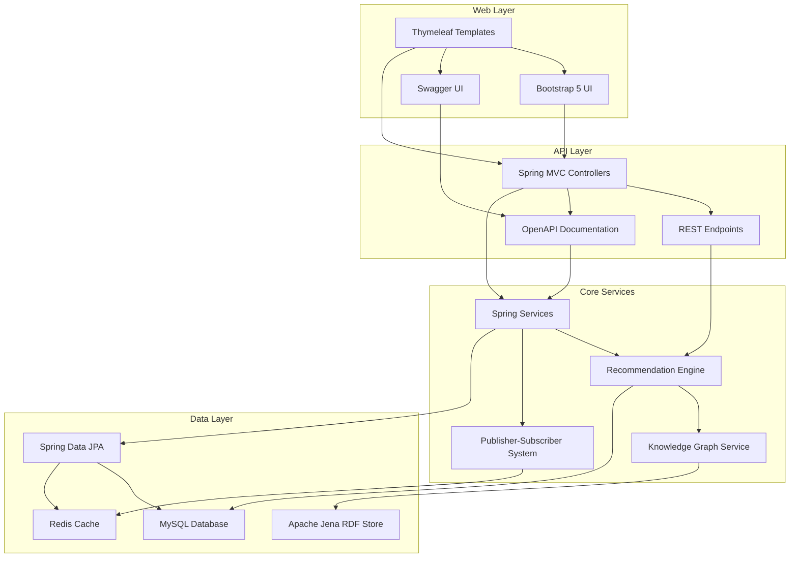

# Social Web Recommender for Cruising Ports

<div align="center">


**An intelligent Spring Boot recommendation system for cruise passengers, local businesses, and port authorities**

[Features](#-features) • [Architecture](#-architecture) • [Quick Start](#-quick-start) • [API Documentation](#-api-documentation) • [Contributing](#-contributing) • [License](#-license)

</div>

---

## 📋 Table of Contents

- [Overview](#-overview)
- [Features](#-features)
- [Architecture](#-architecture)
- [Technology Stack](#-technology-stack)
- [Quick Start](#-quick-start)
- [Installation](#-installation)
- [Configuration](#-configuration)
- [API Documentation](#-api-documentation)
- [Database Schema](#-database-schema)
- [Development Roadmap](#-development-roadmap)
- [Contributing](#-contributing)
- [Support](#-support)
- [License](#-license)

## 🌟 Overview

The **Social Web Recommender for Cruising Ports** is a comprehensive Spring Boot application designed to revolutionize the cruise tourism experience. By leveraging RDF knowledge graphs, machine learning, and real-time publisher-subscriber systems, it provides intelligent recommendations for cruise passengers while enabling local businesses and port authorities to prepare for incoming ships.

### Key Capabilities

- 🎯 **Personalized Recommendations**: AI-powered suggestions for attractions, dining, and activities
- 📡 **Real-time Notifications**: Publisher-subscriber system for instant updates
- 🗺️ **Knowledge Graph Integration**: RDF/SPARQL-based semantic data processing
- 🚢 **Cruise Ship Integration**: Automated port arrival notifications and capacity planning
- 🏢 **Business Intelligence**: Analytics for local businesses and port authorities
- 🔒 **Security & Privacy**: GDPR-compliant data handling and user privacy protection

## ✨ Features

### For Cruise Passengers
- **Smart Recommendations**: Personalized suggestions based on interests and preferences
- **Interactive Web Interface**: Beautiful Thymeleaf-based UI with Bootstrap 5
- **Booking Integration**: Seamless reservations for restaurants, tours, and activities
- **Social Features**: Connect with fellow passengers and share experiences
- **Real-time Updates**: Live notifications about port activities and offers

### For Local Businesses
- **Publisher Dashboard**: Manage content, offers, and availability via REST APIs
- **Cruise Arrival Alerts**: Advance notifications about incoming ships and passenger estimates
- **Analytics & Insights**: Track customer preferences and booking patterns
- **Dynamic Pricing**: Adjust rates based on demand and capacity
- **Customer Management**: Track reservations and customer preferences

### For Port Authorities
- **Infrastructure Planning**: Monitor capacity and resource requirements
- **Security Coordination**: Real-time passenger tracking and safety management
- **Economic Impact**: Analyze tourism revenue and business performance
- **Emergency Response**: Rapid communication system for incidents
- **Regulatory Compliance**: Automated reporting and documentation

## 🏗️ Architecture

### System Components



### Data Flow

1. **User Interaction** → Thymeleaf templates capture preferences and behavior
2. **Knowledge Graph** → Apache Jena processes RDF data and SPARQL queries
3. **ML Engine** → Spring services generate recommendations using collaborative filtering
4. **Publisher-Subscriber** → Spring WebSocket distributes real-time notifications
5. **Database** → Spring Data JPA stores and analyzes all interactions

## 🛠️ Technology Stack

### Backend
- **Runtime**: Java 17+
- **Framework**: Spring Boot 3.2+
- **Database**: MySQL 8.0
- **Cache**: Redis 6.0+
- **ORM**: Spring Data JPA / Hibernate
- **Security**: Spring Security with JWT

### API Documentation
- **Framework**: SpringDoc OpenAPI 3
- **UI**: Swagger UI
- **Documentation**: OpenAPI Specification

### Data & AI
- **Knowledge Graph**: Apache Jena / Virtuoso
- **RDF Processing**: SPARQL 1.1
- **ML Framework**: Custom algorithms with Spring services
- **Vector Database**: Future integration planned

### Infrastructure
- **Containerization**: Docker & Docker Compose
- **Orchestration**: Kubernetes ready
- **Monitoring**: Spring Boot Actuator
- **Logging**: SLF4J with Logback

## 🚀 Quick Start

### Prerequisites

- Java 17 or higher
- Maven 3.8+
- MySQL 8.0 or higher
- Redis 6.0 or higher
- Docker and Docker Compose (optional)

### Installation

1. **Clone the repository**
   ```bash
   git clone https://github.com/your-org/social-web-recommender.git
   cd social-web-recommender
   ```

2. **Set up environment variables**
   ```bash
   cp src/main/resources/application.yml.example src/main/resources/application.yml
   # Edit application.yml with your configuration
   ```

3. **Initialize the database**
   ```bash
   # Create database and run migrations
   mysql -u root -p -e "CREATE DATABASE cruise_recommender;"
   mvn spring-boot:run -Dspring-boot.run.arguments="--spring.profiles.active=dev"
   ```

4. **Start the application**
   ```bash
   mvn spring-boot:run
   ```

The application will be available at:
- **Web Interface**: `http://localhost:8080`
- **API Documentation**: `http://localhost:8080/swagger-ui.html`
- **Health Check**: `http://localhost:8080/actuator/health`

## ⚙️ Configuration

### Application Configuration

```yaml
# Database Configuration
spring:
  datasource:
    url: jdbc:mysql://localhost:3306/cruise_recommender
    username: xx
    password: xx
    driver-class-name: com.mysql.cj.jdbc.Driver

# Redis Configuration
spring:
  data:
    redis:
      host: localhost
      port: 6379
      password: xx

# External APIs
google:
  maps:
    api:
      key: xx
weather:
  api:
    key: xx
sparql:
  endpoint: https://your-sparql-endpoint.com/sparql

# Security
jwt:
  secret: xx
  expiration: 604800000

# Notification Services
spring:
  mail:
    host: smtp.gmail.com
    port: 587
    username: xx
    password: xx
```

## 📚 API Documentation

### Authentication
All API endpoints require authentication via JWT tokens.

### Core Endpoints

#### Recommendations
```http
GET /api/v1/recommendations
POST /api/v1/recommendations/feedback
GET /api/v1/recommendations/history
POST /api/v1/recommendations/refresh
GET /api/v1/recommendations/explain/{id}
```

#### Publishers
```http
GET /api/v1/publishers
POST /api/v1/publishers
GET /api/v1/publishers/{id}
PUT /api/v1/publishers/{id}
POST /api/v1/publishers/{id}/content
GET /api/v1/publishers/{id}/subscribers
```

#### Subscriptions
```http
GET /api/v1/subscriptions
POST /api/v1/subscriptions
DELETE /api/v1/subscriptions/{id}
PUT /api/v1/subscriptions/{id}
GET /api/v1/subscriptions/{id}/notifications
```

#### Ports
```http
GET /api/v1/ports
GET /api/v1/ports/{id}
GET /api/v1/ports/{id}/capacity
GET /api/v1/ports/{id}/cruises
```

### Response Format
```json
{
  "success": true,
  "data": {
    // Response data
  },
  "meta": {
    "timestamp": "2024-01-01T00:00:00Z",
    "version": "1.0.0"
  }
}
```

## 🗄️ Database Schema

### Core Tables

#### Users
```sql
CREATE TABLE users (
  id INT PRIMARY KEY AUTO_INCREMENT,
  email VARCHAR(255) UNIQUE NOT NULL,
  password_hash VARCHAR(255) NOT NULL,
  preferences JSON,
  created_at TIMESTAMP DEFAULT CURRENT_TIMESTAMP,
  updated_at TIMESTAMP DEFAULT CURRENT_TIMESTAMP ON UPDATE CURRENT_TIMESTAMP
);
```

#### Ports
```sql
CREATE TABLE ports (
  id INT PRIMARY KEY AUTO_INCREMENT,
  port_code VARCHAR(10) UNIQUE NOT NULL,
  name VARCHAR(255) NOT NULL,
  country VARCHAR(100) NOT NULL,
  coordinates POINT NOT NULL,
  capacity INT NOT NULL,
  facilities JSON,
  created_at TIMESTAMP DEFAULT CURRENT_TIMESTAMP
);
```

#### Recommendations
```sql
CREATE TABLE recommendations (
  id INT PRIMARY KEY AUTO_INCREMENT,
  user_id INT NOT NULL,
  port_id INT NOT NULL,
  item_type ENUM('attraction', 'restaurant', 'activity', 'shop'),
  item_id INT NOT NULL,
  score DECIMAL(3,2) NOT NULL,
  reasoning TEXT,
  created_at TIMESTAMP DEFAULT CURRENT_TIMESTAMP,
  FOREIGN KEY (user_id) REFERENCES users(id),
  FOREIGN KEY (port_id) REFERENCES ports(id)
);
```

## 📅 Development Roadmap

### Week 1-2: Foundation & Core Setup
- [x] **Project Structure**: Set up Spring Boot architecture
- [x] **Database Design**: Implement MySQL schema with JPA
- [x] **API Framework**: Create RESTful API endpoints
- [x] **Authentication**: Implement JWT-based auth system
- [x] **Basic CRUD**: User, port, and recommendation operations

### Week 3-4: Knowledge Graph & Recommendations
- [ ] **RDF Integration**: Set up Apache Jena SPARQL endpoint
- [ ] **Data Import**: Import ports_A.json and external data
- [ ] **ML Pipeline**: Implement recommendation algorithms
- [ ] **Knowledge Graph**: Build semantic relationships
- [ ] **Testing**: Unit and integration tests

### Week 3-4: Publisher-Subscriber System
- [ ] **Pub-Sub Engine**: Real-time notification system with WebSocket
- [ ] **WebSocket Integration**: Live updates for users
- [ ] **Business Dashboard**: Publisher management interface
- [ ] **Notification Templates**: Email and push notifications
- [ ] **Analytics**: User engagement tracking

### Week 5-6: Cruise Integration & Advanced Features
- [ ] **Cruise API**: Integration with cruise line systems
- [ ] **Capacity Management**: Port authority dashboard
- [ ] **Booking System**: Reservation and payment processing
- [ ] **Mobile Responsiveness**: Enhanced mobile experience
- [ ] **Performance Optimization**: Caching and scaling

### Week 7-8: Production & Deployment
- [ ] **Security Audit**: Penetration testing and hardening
- [ ] **Performance Testing**: Load testing and optimization
- [ ] **Documentation**: Complete API and user documentation
- [ ] **Deployment**: Production environment setup
- [ ] **Monitoring**: Logging and alerting systems

## 🤝 Contributing

We welcome contributions from the community! Please follow these guidelines:

### Getting Started
1. Fork the repository
2. Create a feature branch: `git checkout -b feature/amazing-feature`
3. Commit your changes: `git commit -m 'Add amazing feature'`
4. Push to the branch: `git push origin feature/amazing-feature`
5. Open a Pull Request

### Development Guidelines
- Follow the existing code style and conventions
- Write comprehensive tests for new features
- Update documentation for API changes
- Ensure all tests pass before submitting PR

### Code Style
- Use Spring Boot best practices
- Follow Java naming conventions
- Use meaningful variable and method names
- Add Javadoc for public methods
- Maintain test coverage above 80%

## 📞 Support

### Documentation
- [API Documentation](http://localhost:8080/swagger-ui.html)
- [Architecture Documentation](docs/architecture/C4-Level1-Context.md)
- [Contributing Guide](CONTRIBUTING.md)

### Community
- [GitHub Discussions](https://github.com/your-org/social-web-recommender/discussions)
- [Issues](https://github.com/your-org/social-web-recommender/issues)
- [Security](SECURITY.md)

### Commercial Support
For enterprise support and custom implementations, contact us at:
- Email: enterprise@xx (TBD)
- Phone: +1 (234) 567-890 (TBD)

## 📄 License

This project is licensed under the MIT License - see the [LICENSE](LICENSE) file for details.

### Third-Party Licenses
- [Spring Boot](https://spring.io/projects/spring-boot)
- [Apache Jena](https://jena.apache.org/)
- [MySQL](https://www.mysql.com/about/legal/licensing/)
- [Redis](https://redis.io/license)

---

<div align="center">

**Made with ❤️ for the cruise tourism community**

[Website](https://xxTBDxx) • [Blog](https://blog.xxTBDxx) • [Twitter](https://twitter.com/xxTBDxx)

</div>
